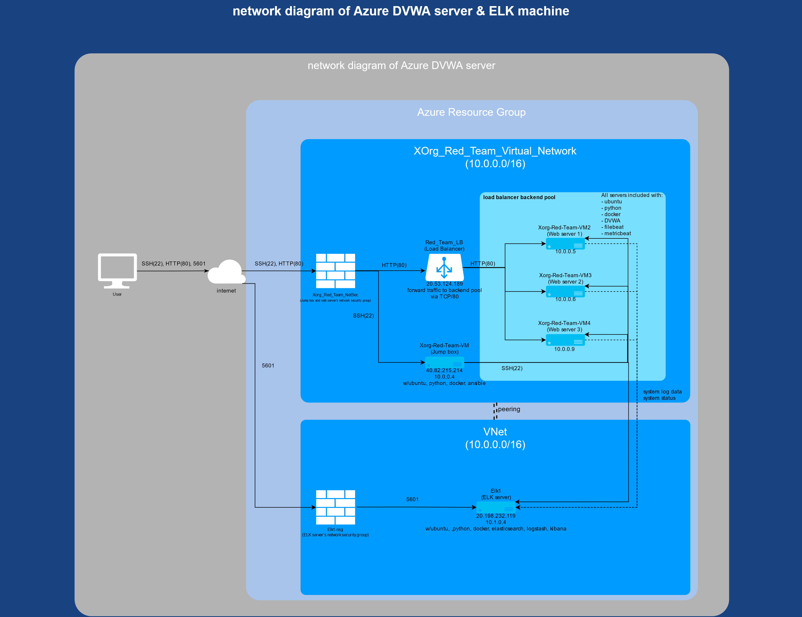

## Automated ELK Stack Deployment

The files in this repository were used to configure the network depicted below.



These files have been tested and used to generate a live ELK deployment on Azure. They can be used to either recreate the entire deployment pictured above. Alternatively, select portions of the Playbook file may be used to install only certain pieces of it, such as _Filebeat_ and __Metricbeat__.


This document contains the following details:
- Description of the Topology
- Access Policies
- ELK Configuration
  - Beats in Use
  - Machines Being Monitored
- How to Use the Ansible Build


### Description of the Topology

The main purpose of this network is to expose a load-balanced and monitored instance of DVWA, the D*mn Vulnerable Web Application.

Having a Load balancer on each web server ensures that the application will be __highly available__, in addition to restricting __traffic overloading__ to the network.

Integrating an ELK server allows users to easily monitor the vulnerable VMs for changes to the __files and settings__ and __system utilisation__.

The configuration details of each machine may be found below.

| Name     | Function   | IP Address(external IP address)              | Operating System |
|----------|------------|-------------------------|------------------|
| Xorg-Red-Team-VM(Jump Box) | Gateway    | 10.0.0.4(40.82.215.214)  | Linux            |
| Xorg-Red-Team-VM2(Web Server1)     | Web server | 10.0.0.5                | Linux            |
| Xorg-Red-Team-VM3(Web Server2)     | Web Server | 10.0.0.6                | Linux            |
| Xorg-Red-Team-VM4(Web Server3)     | Web Server | 10.0.0.9                | Linux            |
| Elk(ELK Machine)      | ELK Server | 10.1.0.4(20.198.232.119) | Linux            |

### Access Policies

The machines on the internal network are not exposed to the public Internet.

Only the __Jump Box and ELK machine__ can accept connections from the Internet. Access to these machine is only allowed from the following IP addresses:

|   Name | IP address    | Port    |
|---------------|----------------|---------|
| local machine | 125.253.29.150 | 22(SSH), 5601 |

These Machines within the network can only be accessed by __ansible container in the jump box(10.0.0.4)__.

| Name          | IP Address     | Port    |
|---------------|----------------|---------|
| Web Server1-3 | 10.0.0.4       | 22(SSH) |
| ELK Machine   | 10.0.0.4       | 22(SSH) |


A summary of the access policies in place can be found in the table below.

| Name        | Publicly Accessible | Allowed IP Addresses         |
|-------------|---------------------|------------------------------|
| Jump Box    | Yes                 | 125.253.29.150               |
| ELK Machine | Yes                 | 125.253.29.150               |
| Web Server1-3 |  Yes              | 20.53.124.189(Load Balancer) |


### Elk Configuration

Ansible was used to automate configuration of the ELK machine. No configuration was performed manually, which is advantageous because it could enable make batch process to multiple machines at once instead of configuring them one by one, which hugely reduce time consumption, error rate, complexity, and improve consistency to each machine.

The playbook implements the following tasks:

- Install docker, pip3
- Install docker's python module
- Expand Elk server's virtual memory size
- Download and activate ELK container image
- Set the docker service enabled on boot

The following screenshot displays the result of running `docker ps` after successfully configuring the ELK instance.


### Target Machines & Beats
This ELK server is configured to monitor the following machines:

|Name  |IP address |
|------|-----------|
|Web Server1   |10.0.0.5   |
|Web Server2   |10.0.0.6   |
|Web Server3  |10.0.0.9   |


We have installed the following Beats on these machines:
- Filebeat
- Metricbeat

These Beats allow us to collect the following information from each machine:
- Filebeat: system-generated logs
  - eg: login records, root user(sudo), privilege requests, software/system generated log record, user/group changes
- Metricbeat: system status
  - eg: CPU usage, System Memory usage, Network traffics status, Disk utilisation

(sounds like the Description of the Topology one???)

### Using the Playbook
In order to use the playbook, you will need to have an Ansible control node already configured. Assuming you have such a control node provisioned:

SSH into the control node and follow the steps below:
- setup blank __playbook and configuration__ files to the __Ansible container__.
  - ELK
    - ```hosts.yml```
    - ```install-elk.yml```
  - Filebeat
    - ```filebeat-config.yml```
    - ```filebeat-playbook.yml```
  - Metricbeat
    - ```metricbeat-config.yml```
    - ```metricbeat-playbook.yml```

  _(all playbook and configuration files is saved in resources/roles and resources/files respectively.)_

- Update the __playbook and configuration__ file to include...
  - ELK
    - in ```hosts.yml```:
      - add new host group ```elk``` which contains the IP of ELK machine
        ```bash
        [elk]
        #10.1.0.4 ansible_python_interpreter=/usr/bin/python3
        ```
    - in ```install-elk.yml``` :
      - list the target machine host group (Elk) and those machine's login username
      ```bash
        hosts: elk
        remote_user: azureuser
        become: true
      ```
      - implement tasks for configure and installing ELK and its required packages
        - install necessary packages(docker.io pip3, docker module)
          ```bash
          #use apt module
          - name: install docker.io
            apt:
              update_cache: yes
              force_apt_get: yes
              name: docker.io
              state: present

          #use apt module
          - name: Install pip3
            apt:
              force_apt_get: yes
              name: python3-pip
              state: present

          #use pip module(it will default to pip3)
          - name: Install Docker module
            pip:
              name: docker
              state: present
          ```
        - expanding target machine's virtual memory
          ```bash
          #use command module
          - name: Increase virtual memory
            command: sysctl -w vmmax_map_count=262144

          #use sysctl module
          - name: Use More Memory
            sysctl:
              name: vm.max_map_count
              value: '262144'
              state: present
              reload: yes
          ```
        - install ELK container
          ```bash
          #use docker_container module
          - name: download and launch a docker elk container
            docker_container:
              name: elk
              image: sebp/elk:761
              state: started
              restart_policy: always
              #list the ports that Elk runs on
              published_ports:
                - 5601:5601
                - 9200:9200
                - 5044:5044
          ```
        - make the ELK system activated on start
          ```bash
          #use systemd module
          - name: Enable docker service
            systemd:
              name: docker
              enabled: yes
          ```

  - Filebeat
    - in ```filebeat-config.yml```:
      - download the configuration file template
          ```
          curl https://gist.githubusercontent.com/slape/5cc350109583af6cbe577bbcc0710c93/raw/eca603b72586fbe148c11f9c87bf96a63cb25760/Filebeat >> /etc/ansible/files/filebeat-config.yml
        ```
      - replace the default IP address in the config file to ELK machine's IP, also defines the default account credentials.
        ```bash
        #in Elasticsearch Output session:
        output.elasticsearch:
          hosts: ["10.1.0.4:9200"]
          username: "elastic"
          password: "changeme"
        #in Kibana session:
        setup.kibana:
          host: "10.1.0.4:5601"
        ```

    - in ```filebeat-playbook.yml```:
      - list the target machine host group and those machine's login username
        ```bash
        - name: Install metric beat
        hosts: webservers
        remote_user: azureuser
        become: yes
      ```
      - tasks for configure and installing filebeat
        - download and install Filebeat
          ```bash
          - name: download filebeat deb
            command: curl -L -O https://artifacts.elastic.co/downloads/beats/filebeat/filebeat-7.6.1-amd64.deb

          - name: install filebeat deb
            command: dpkg -i filebeat-7.6.1-amd64.deb
          ```
        - send the customized configured file to the filebeat system
          ```bash
          - name: drop in filebeat.yml
            copy:
              src: /etc/ansible/files/filebeat-config.yml
              dest: /etc/filebeat/filebeat.yml

          ```
        - setup and activate filebeat system
          ```bash
          - name: enable and configure system module
            command: filebeat modules enable system

          - name: setup filebeat
            command: filebeat setup

          - name: start filebeat service
            command: service filebeat start

          ```
        - enable filebeat system started on boot
          ```bash
          - name: enable service filebeat on boot
            systemd:
              name: filebeat
              enabled: yes
          ```


  - Metricbeat
    - in ```metricbeat-config.yml```:
      - download the configuration file template
          ```
          curl https://gist.githubusercontent.com/slape/58541585cc1886d2e26cd8be557ce04c/raw/0ce2c7e744c54513616966affb5e9d96f5e12f73/metricbea >> /etc/ansible/files/metricbeat-config.yml
        ```
      - replace the default IP address in the config file to ELK machine's IP, also defines the default account credentials.
        ```bash
        #in Elasticsearch Output session:
        output.elasticsearch:
          hosts: ["10.1.0.4:9200"]
          username: "elastic"
          password: "changeme"
        #in Kibana session:
        setup.kibana:
          host: "10.1.0.4:5601"
        ```

    - in ```metricbeat-playbook.yml```:
      - list the target machine host group and those machine's login username
        ```bash
        - name: Install metric beat
          hosts: webservers
          become: true
      ```
      - tasks for configure and installing metricbeat
        - download and install metricbeat
          ```bash
          - name: Download metricbeat
            command: curl -L -O https://artifacts.elastic.co/downloads/beats/metricbeat/metricbeat-7.6.1-amd64.deb

          - name: install metricbeat
            command: sudo dpkg -i metricbeat-7.6.1-amd64.deb
          ```
        - send the customized configured file to the filebeat system
          ```bash
          - name: drop in metricbeat config
            copy:
              src: /etc/ansible/files/metricbeat-config.yml
              dest: /etc/metricbeat/metricbeat.yml
          ```
        - setup and activate metricbeat system
          ```bash
          - name: enable and configure docker module for metric beat
            command: metricbeat modules enable docker

          - name: setup metric beat
            command: sudo metricbeat setup

          - name: start metric beat
            command: sudo service metricbeat start
          ```
        - enable metricbeat system started on boot
          ```bash
          - name: enable service metricbeat on boot
            systemd:
              name: metricbeat
              enabled: yes
          ```

- Run the playbook, and navigate to __http://[ELK server IP address]:5601/app/kibana__* to check that the installation worked as expected.

     _*ELK server IP address is listed above_
  ```bash
  sudo ansible-playbook /etc/ansible/roles/install-elk.yml
  sudo ansible-playbook /etc/ansible/roles/filebeat-playbook.yml
  sudo ansible-playbook /etc/ansible/roles/metricbeat-playbook.yml
  ```
    - Screenshots of expected output
      - ELK
        - interface access after installation
        
      - Filebeat
        - during installation
        
        - expected interface access after installation
        
      - Metricbeat
        - during installation
        
        - expected interface access after installation
        
