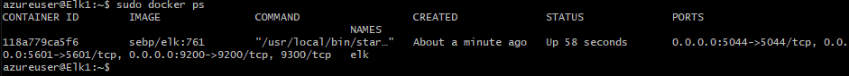

## Automated ELK Stack Deployment

The files in this repository were used to configure the network depicted below.


These files have been tested and used to generate a live ELK deployment on Azure. They can be used to either recreate the entire deployment pictured above. Alternatively, select portions of the Playbook file may be used to install only certain pieces of it, such as Filebeat.

  - _TODO: Enter the playbook file._

This document contains the following details:
- Description of the Topology
- Access Policies
- ELK Configuration
  - Beats in Use
  - Machines Being Monitored
- How to Use the Ansible Build


### Description of the Topology

The main purpose of this network is to expose a load-balanced and monitored instance of DVWA, the D*mn Vulnerable Web Application.

And having a Load balancing on each web server ensures that the application will be highly available, and reduce loading impact as an addition.
- _TODO: What aspect of security do load balancers protect? What is the advantage of a jump box?_ <--*(done)*

Integrating an ELK server allows users to easily monitor the vulnerable VMs for changes to the file? and system records?.

Filebeat system in the ELK server is used to record file system logs and alerts, such as:
- login records
- root user(sudo) privilege requests
- software/system generated log record
- user/group changes

And Metricbeat is used to record machine metrics, such as:
-  CPU usage
-  System Memory usage
-  Network traffics status
-  Disk utilisation
- _TODO: What does Filebeat watch for?_
- _TODO: What does Metricbeat record?_
(done?)

The configuration details of each machine may be found below.
_Note: Use the [Markdown Table Generator](http://www.tablesgenerator.com/markdown_tables) to add/remove values from the table_.

| Name     | Function   | IP Address              | Operating System |
|----------|------------|-------------------------|------------------|
| Xorg-Red-Team-VM(Jump Box) | Gateway    | 10.0.0.4 40.82.215.214  | Linux            |
| Xorg-Red-Team-VM2(Web1)     | Web server | 10.0.0.5                | Linux            |
| Xorg-Red-Team-VM3(Web2)     | Web Server | 10.0.0.6                | Linux            |
| Xorg-Red-Team-VM4(Web3)     | Web Server | 10.0.0.9                | Linux            |
| Elk      | ELK server | 10.1.0.4 20.198.232.119 | Linux            |

### Access Policies

The machines on the internal network are not exposed to the public Internet.

Only the __jump box__ machine can accept connections from the Internet. Access to this machine is only allowed from the following IP addresses:
- _TODO: Add whitelisted IP addresses_ (done? only for the jump box-related NSG rules?)

| Name          | IP             | Port    |
|---------------|----------------|---------|
| local machine | 125.253.29.150 | 22(SSH) |
| load balancer | 20.53.124.189  | 80(HTTP)|

Machines within the network can only be accessed by __ansible container in the jump box(10.0.0.4)__.

- _TODO: Which machine did you allow to access your ELK VM? What was its IP address?_ (done?)


A summary of the access policies in place can be found in the table below.

| Name        | Publicly Accessible | Allowed IP Addresses         |
|-------------|---------------------|------------------------------|
| Jump Box    | Yes                 | 125.253.29.150               |
| ELK Machine | Yes                 | 125.253.29.150               |
| Web1, Web2, Web3 |  No            |    |

(not sure how to do, is it simply based on the rules in the security group?)


### Elk Configuration

Ansible was used to automate configuration of the ELK machine. No configuration was performed manually, which is advantageous because it could enable make batch process to multiple machines at once instead of configuring them one by one, which hugely reduce time consumption, error rate, complexity, and improve consistency to each machine.
- _TODO: What is the main advantage of automating configuration with Ansible?_ (done)


The playbook implements the following tasks:
- _TODO: In 3-5 bullets, explain the steps of the ELK installation play. E.g., install Docker; download image; etc._ (done?)
- Install docker, pip3
- Install docker's python module
- Expand Elk server's virtual memory size
- Download and activate ELK container image
- Set the docker service enabled on boot

The following screenshot displays the result of running `docker ps` after successfully configuring the ELK instance.



### Target Machines & Beats
This ELK server is configured to monitor the following machines:
- _TODO: List the IP addresses of the machines you are monitoring_
|Name  |IP address |
|------|-----------|
|Xorg-Red-Team-VM2(Web1)   |10.0.0.5   |
|Xorg-Red-Team-VM3(Web2)   |10.0.0.6   |
|Xorg-Red-Team-VM4(Web3)   |10.0.0.9   |


We have installed the following Beats on these machines:
- _TODO: Specify which Beats you successfully installed_ (done)
- Filebeat
- Metricbeat

These Beats allow us to collect the following information from each machine:
- Filebeat: system logs (eg: login events, error messages)
- Metricbeat: system status (eg: CPU usage, memory consumption)
- _TODO: In 1-2 sentences, explain what kind of data each beat collects, and provide 1 example of what you expect to see. E.g., `Winlogbeat` collects Windows logs, which we use to track user logon events, etc._

### Using the Playbook
In order to use the playbook, you will need to have an Ansible control node already configured. Assuming you have such a control node provisioned:

SSH into the control node and follow the steps below:
- Copy the __playbook and configurable__ file to __the Ansible container__.
- Update the __playbook__ file to include...
  - Filebeat
    - f
    ```
      sudo 123
    ```
  - Metricbeat
    - f
  - ELK
    - f
- Run the playbook, and navigate to __the machine's IP address via browser__ to check that the installation worked as expected.

_TODO: Answer the following questions to fill in the blanks:_
- _Which file is the playbook? Where do you copy it?_
- _Which file do you update to make Ansible run the playbook on a specific machine? How do I specify which machine to install the ELK server on versus which to install Filebeat on?_
- _Which URL do you navigate to in order to check that the ELK server is running?_
(not sure)

_As a **Bonus**, provide the specific commands the user will need to run to download the playbook, update the files, etc._
